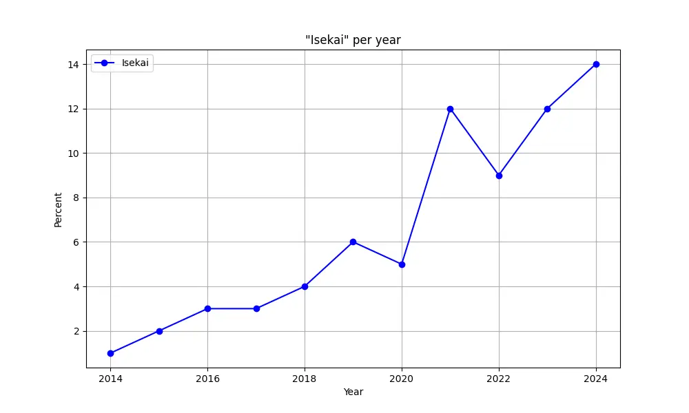

# Anime Stats
Auto-generate some simple statistics on anime.

`myanimelist` themselves compiled [some numbers on the rising number of
isekais](https://www.youtube.com/channel/UCU0aTuvkzjJA9Xajnpa0AWw/community?lb=UgkxpZ0Q_5rJ2fAa7MZ9ow-1ipf4m136jMAX).
However, they have not factored in the increasing total number of shows per
year, which sparked my curiosity and led to this small project.

<!-- toc -->

- [Usage](#usage)
- [Data Source](#data-source)
- [Example Output](#example-output)

<!-- tocstop -->

## Usage

```bash
# init
python3 -m venv ./.venv
source ./.venv/bin/activate 
python3 -m pip install -r requirements.txt

# run
genre="Romance"
start_year="2014"
python3 -m python.main "$genre" "$start_year"
```

Using the task runner [just](https://just.systems/man/en/):

```bash
just init
just genre="Romance" start_year=2014 run
just run_fzf # using `fzf` and `yq`, select a genre interactively
```

> [!NOTE]
> Available genres can be seen here: <https://api.jikan.moe/v4/genres/anime>  
> You can also use `just run_fzf` to select a genre interactively, if you have
> `just`, `fzf`, and `yq` installed.

## Data Source
Data from [myanimelist](http://myanimelist.net), using the [Jikan
API](https://jikan.moe/).

## Example Output

```txt
Isakais per year
2014: 2/187 (1%)
2015: 4/204 (2%)
2016: 7/229 (3%)
2017: 6/225 (3%)
2018: 9/224 (4%)
2019: 11/182 (6%)
2020: 8/175 (5%)
2021: 24/204 (12%)
2022: 17/189 (9%)
2023: 29/240 (12%)
2024: 24/174 (14%)
```


